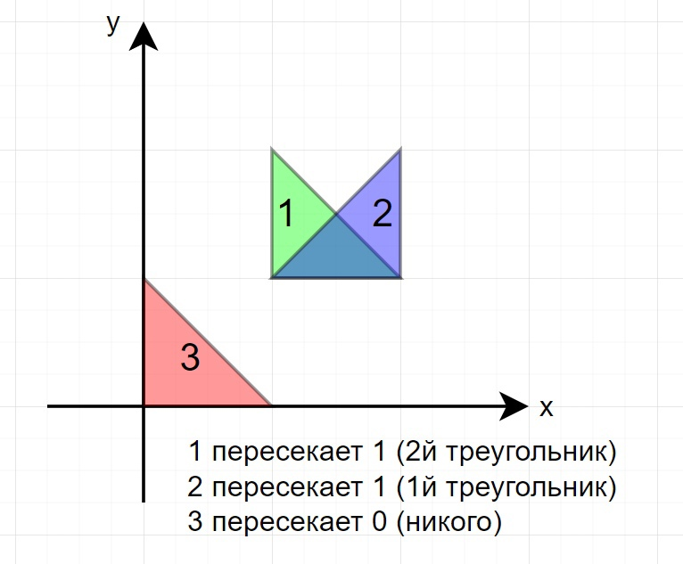

# задание:

### Требования:
 с++14, консольное приложение, без сторонних библиотек, windows/linux x64

### Задание:
Нужно написать алгоритм, который определяет пересекаются ли треугольники в 2D пространстве.
Пересечением считать наличие хотя бы одной общей точки. 

Алгоритм реализовать в виде функции (представляем, что эта функция часть большого проекта): 

```c++
void checkIntersections(const std::vector<Triangle> &in_triangles, std::vector<int> &out_count)
{
//...
}
```
- На вход вы получаете N треугольников, где 1 <= in_triangles.size <= 10^5
- Результатом является N целых чисел, каждое из которых это количество треугольников, которые i-й треугольник пересекает.

### Example:

>**in_triangles:** {{1.0, 1.0}, {1.0, 2.0}, {2.0 1.0}}, {{1.0, 1.0}, {2.0, 1.0}, {2.0 2.0}}, {{0.0, 0.0}, {1.0, 0.0}, {0.0, 1.0}} \
>**out_count:** {1, 1, 0} \
>**Explanation:** 1й и 2й треугольники пересекают друг друга. 3й не пересекает никого.



### В архиве вы найдете несколько файлов:

часть "большого проекта" - то, что **нельзя** модифицировать. 
- `bin/input.txt` - пример входного файла
- `include/сommon.h`
- `include/task.h`
- `source/main.cpp`
- `CMakeLists.txt`

то, что вы **можете** модифицировать:
- `source/task.cpp` - должен содержать реализацию функции `checkIntersections`. **В качестве ответа прислать только этот файл!**


Опционально (или то, на что мы обращаем внимание):

- Читабельность и чистота кода
- Алгоритмическая сложность
- Производительность
- Минимум аллокаций на куче
- Многопоточность
- Векторизация
